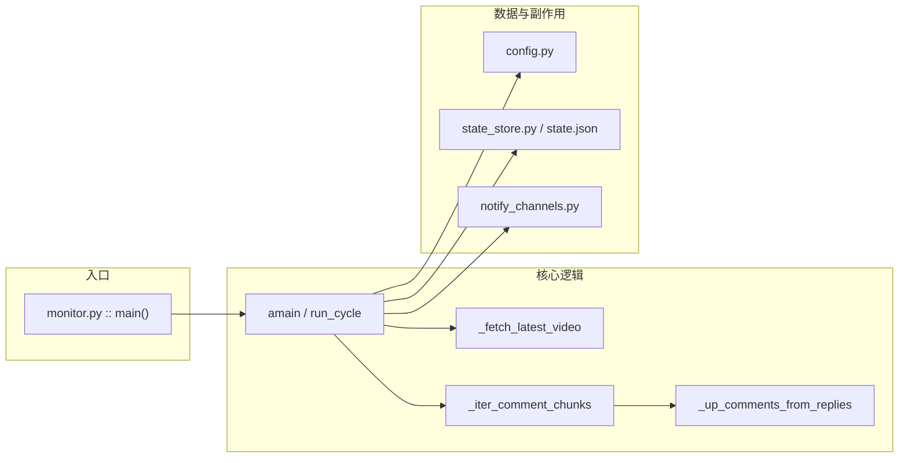

# B 站「最新稿件 · UP 本人评论」监控 — 设计说明

## 1. 目标与范围

在 **不依赖 B 站开放平台商业接口** 的前提下，周期性完成：

1. 同时监控 **最多 3 个** UP 主（`target_mids`，或兼容单字段 `target_mid`）；对每个 UP 分别取其 **当前最新公开投稿**（按发布时间倒序取 1 条）。
2. 在各稿件评论区中，识别 **`member.mid` 等于对应 UP `mid` 的评论**（含楼中楼里该 UP 的回复）。
3. 对 **首次见到的评论**（以 B 站评论 `rpid` 去重）触发通知：**B 站私信**（可选）与 **短信相关通道**（Webhook / Twilio，可选）。

**非目标**：监听非最新稿、监听普通观众评论、保证评论区全量爬取、绕过风控或破解验证。

---

## 2. 总体架构

采用 **单进程异步轮询**：`asyncio` 事件循环 + `bilibili-api-python` 提供的异步 API。模块按职责拆分，配置与落盘状态分离。



---

## 3. 模块职责

| 模块 | 职责 |
|------|------|
| `monitor.py` | **编排**：读配置、初始化 HTTP 客户端与凭据、加载状态、主循环、`run_cycle`（换稿检测、bootstrap、增量扫描、通知）。 |
| `config.py` | **配置模型**：`AppConfig` 及子结构；`load_config(path)` 从 JSON 反序列化（UTF-8）。 |
| `state_store.py` | **持久化**：`state.json` 内按 UP 分片 `ups[<mid>]`，每片含 `bvid`、`seen_rpids`、`bootstrapped`；兼容旧版单文件扁平结构（仅当配置为 1 个 UP 时自动迁移）。UTF-8、`ensure_ascii=False`。 |
| `notify_channels.py` | **通知适配**：`send_bilibili_dm`（异步）；`send_sms_webhook` / `send_twilio_sms`（同步 IO，由 `asyncio.to_thread` 调用）。 |
| `encoding_utils.py` | **终端编码**：Windows 下尽量将控制台与标准流切到 UTF-8，减少中文日志乱码。 |

---

## 4. 核心设计决策

### 4.1 最新稿件来源

- 使用 `bilibili_api.user.User.get_videos(pn=1, ps=1, order=VideoOrder.PUBDATE)`。
- 解析返回体中的 **`list.vlist[0]`**（与部分旧文档中的 `data.list` 形态不同，以实际接口为准）。

### 4.2 评论拉取与排序

- 使用 `bilibili_api.comment.get_comments_lazy`，资源类型 `CommentResourceType.VIDEO`，`oid` 为视频 **aid**（由 `Video(bvid=...).get_aid()` 得到）。
- 排序：`OrderType.TIME`，使 **新近评论靠前**，便于用少量页数覆盖「UP 新发评论」场景。
- 分页：依赖返回 `cursor.pagination_reply.next_offset`；无下一页或接口截断时停止。未登录时可能只能拉有限页数，代码内会打日志提示补充 `credential`。

### 4.3 何为「UP 的评论」

- 对每一页 `replies` 做 **树展开**（`_flatten_replies`），任意节点满足  
  `int(reply["member"]["mid"]) == 当前轮询的 up_mid` 即视为该 UP 的发言。

### 4.4 多 UP 与轮询顺序

- `cfg.target_mids` 为去重后的列表，长度 1～3；`run_cycle` **顺序**处理每个 mid，各自独立的 `UpMonitorState`。某一 UP 抛错仅记日志，不阻塞其余 UP。

### 4.5 去重与「首轮不落通知」

- **去重键**：评论 `rpid`（整型），按 UP 存入 `RootState.ups[str(mid)].seen_rpids`。
- **Bootstrap**：每个 UP 的每个 `bvid` 首次进入监控时，按 `bootstrap_max_pages` 扫描若干页，把所有已出现的 UP 评论 `rpid` 写入 `seen_rpids`，并设 `bootstrapped=True`，**不发送通知**；日志前缀 **`[首轮记录][不通知]`**，并 **打印全文**。
- **增量轮询**：`bootstrapped` 之后，每轮在最前若干页（`max_pages_per_poll`）中合并该 UP 的评论，对本轮拉取范围内出现的每条 UP 评论：**已在本轮开始前即存在于 `seen_rpids` 的** 打日志 **`[已记录]`** 并打印全文；**本轮新出现的** 打 **`[新评论]`** 并打印全文，再按 `ctime` 排序后逐条通知并写入集合。

### 4.6 换稿行为

对每个 UP：若其最新 `bvid` 与该 UP 分片内的 `state.bvid` 不一致：清空该分片的 `seen_rpids`，`bootstrapped=False`，下一循环重新对该稿做 bootstrap。

### 4.7 通知语义

- **B 站「通知」**：平台无公开「推一条 App 系统通知」API，实现为 **向指定 UID 发私信**（`bilibili_api.session.send_msg`，文本）。需配置 `sessdata`、`bili_jct` 等，`bilibili_dm_receiver_uid > 0`。
- **短信**：  
  - `sms_webhook_url`：POST JSON，体包含 `text` 与 `message`（内容相同），便于对接自建网关或国内短信服务商封装。  
  - Twilio：使用 REST，字段见 `config.example.json` 中 `notify.twilio`（发件号码键名为 `from`，加载后映射为 `TwilioConfig.from_number`）。
- **飞书**：`notify.feishu_webhook_url` 填群自定义机器人的 Webhook 地址（[添加机器人](https://open.feishu.cn/document/client-docs/bot-v3/add-custom-bot)）。若机器人开启了**签名校验**，将 `feishu_webhook_secret` 设为口令中的密钥；未开启可留空 `""`。程序按飞书文档组装 `msg_type: text` 并可选附带 `timestamp` / `sign`。

各通道失败互不影响（各自 try/except 记日志）。

---

## 5. 状态与文件路径

| 文件 | 说明 |
|------|------|
| `config.json` | 用户配置（不入库，`.gitignore` 建议忽略）。 |
| `state.json` | 与 **配置文件同目录** 生成/更新（`config_path.parent / "state.json"`），`ups` 下按 mid 记录各 UP 的 `bvid` / `seen_rpids` / `bootstrapped`。 |

---

## 6. 使用入口（必读）

### 6.1 环境与依赖

```bash
pip install -r requirements.txt
```

依赖 `bilibili-api-python` 与 `curl_cffi`（推荐；库会优先注册为 HTTP 客户端并支持浏览器指纹伪装）。亦可能随环境回退到 `httpx` / `aiohttp`。

### 6.2 配置文件

复制 `config.example.json` 为 `config.json`，至少修改：

- `target_mids`：目标 UP 的 mid 数组（**最多 3 个**，自动去重）。仍可用单个 `target_mid` 兼容旧配置。
- 需要私信时：`credential` + `notify.bilibili_dm_receiver_uid`。
- 需要短信时：`notify.sms_webhook_url` 或 `notify.twilio`。
- 需要飞书群通知时：`notify.feishu_webhook_url`（及可选 `feishu_webhook_secret`）。

可选：`curl_impersonate`、`enable_bili_ticket`、`comment_scan` 分页上限等。

### 6.3 命令行入口

唯一程序入口：**`monitor.py`**。

```text
python monitor.py [-c CONFIG] [--once]
```

| 参数 | 含义 |
|------|------|
| `-c` / `--config` | 配置文件路径，默认当前目录下 `config.json`。 |
| `--once` | 只执行 **一轮** `run_cycle` 后退出，便于联调；不加则按 `poll_interval_seconds` 循环。 |

程序启动时依次：`configure_stdio_utf8()` → 解析参数 → `logging.basicConfig` → `asyncio.run(amain(...))`。

### 6.4 编程方式复用（非 CLI）

可从其他脚本导入并调用：

- `load_config(path)` → `AppConfig`
- `asyncio.run(run_cycle(cfg, root_state, state_path, cred))`  
  需自行构造 `RootState`、`Credential | None` 与状态的加载/保存，一般情况下直接使用 CLI 即可。

---

## 7. 风险与运维提示

- **风控**：可能出现 HTTP 412 等；可尝试登录 Cookie、家用网络、`enable_bili_ticket`、或调整 `curl_impersonate`。
- **评论可见性**：未登录或接口限制时，仅能覆盖部分评论页；对「UP 评论始终在很靠前位置」的场景通常足够。
- **凭据安全**：`config.json` 含 Cookie 与第三方密钥，勿提交版本库。

---

## 8. 参考

- 评论拉取示例：[bilibili-api 文档 · 评论](https://nemo2011.github.io/bilibili-api/#/examples/comment)
